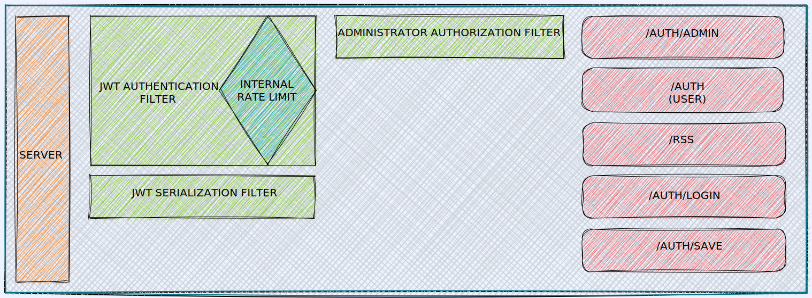

# ⚠️ Deprecated #

This monolithic project is in process of deprecation due to its migration to microservices using Spring boot, in the repository: https://github.com/yanncarvalho/rss-reader-application.

## Rss Reader Application ##

Rss Reader Application is a REST API that manages users accounts and provides xml+rss in json format.

## Software Architecture ##

## Built with ##

- JAX-RS 3.0
- Java 17.0.2
- Gradle 7.4
- MySQL 8.0

## Installation ##

- Download Java [rssreader.war](https://github.com/yanncarvalho/rss-reader-application-legacy/releases)) and made the deploy
- It is recommended to use Wildfly 26.0.1.Final as your server for deploy
- The Database recommeded is MySQL 8.0

## How it works ##

- This project was built using [RSS 2.0 specification](https://validator.w3.org/feed/docs/rss2.html)
- When it is request xml+rss content, the server provides this content in json format
- It is necessary to create an account to use the Endpoints.

## Security ##

- The user authentication was made with JWT, which is generated when user login or update your information
- The program also works with an internal Rate limit, a bucket token that permits each user request 50 requests per minute

## Author ##

- Made by [Yann Carvalho](https://www.linkedin.com/in/yann-carvalho-764abab6/)

## Licensing ##

- Rss Reader Application is licensed under the Apache 2.0 License. See [LICENSE](LICENSE) for the full license text.
